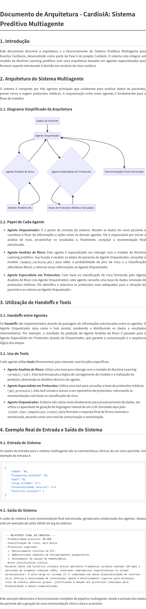

# Documento de Arquitetura - CardioIA: Sistema Preditivo Multiagente

## 1. Introdução

Este documento descreve a arquitetura e o funcionamento do Sistema Preditivo Multiagente para Eventos Cardíacos, desenvolvido como parte da Fase 6 do projeto CardioIA. O sistema integra um modelo de Machine Learning preditivo com uma arquitetura baseada no **OpenAI Agents SDK**, utilizando o endpoint OpenAI-compatível do Google Gemini como backend de LLM.

## 2. Arquitetura do Sistema Multiagente

O sistema é composto por três agentes principais que colaboram para analisar dados de pacientes, prever riscos e sugerir protocolos médicos. A orquestração entre esses agentes é realizada através de **handoffs** nativos do SDK.

### 2.1. Diagrama Simplificado da Arquitetura



**Fluxo de execução:**

```
Dados do Paciente
       │
       ▼
┌──────────────────────────┐
│  Agente Orquestrador     │
│  (coordena via handoffs) │
└──────┬───────────────────┘
       │ handoff()
       ▼
┌──────────────────────────┐
│ Agente Analista de Risco │
│ tool: predict_risk()     │──► Modelo ML (modelo_cardioia.pkl)
└──────┬───────────────────┘
       │ handoff()
       ▼
┌──────────────────────────────────┐
│ Agente Especialista em Protocolos│
│ tool: get_protocols()            │──► Base de Protocolos Simulada
└──────┬───────────────────────────┘
       │
       ▼
  Resposta Final Estruturada
  (validada via Pydantic)
```

### 2.2. Papel de Cada Agente

*   **Agente Orquestrador:** É o ponto de entrada do sistema, definido como `Agent()` do OpenAI Agents SDK. Recebe os dados do novo paciente e coordena o fluxo utilizando **handoffs** nativos do SDK para delegar tarefas aos agentes especializados. Após receber os resultados de ambos os agentes, compila a recomendação final estruturada.

*   **Agente Analista de Risco:** Agente especializado definido com `Agent()`, equipado com a tool `predict_risk` (decorada com `@function_tool`). Sua função é receber os dados clínicos do paciente, consultar o modelo de ML (`modelo_cardioia.pkl`) para obter a probabilidade de pico de risco e a classificação (Alto/Baixo Risco), e retornar essas informações.

*   **Agente Especialista em Protocolos:** Agente especializado definido com `Agent()`, equipado com a tool `get_protocols` (decorada com `@function_tool`). Com base na classificação de risco, consulta uma base de dados simulada de protocolos médicos e retorna os protocolos adequados.

## 3. Utilização de Handoffs, Tools, Histórico e Validação

### 3.1. Handoffs entre Agentes

Os **handoffs** são implementados utilizando a função `handoff()` nativa do OpenAI Agents SDK. O Agente Orquestrador possui dois handoffs configurados:

```python
handoffs=[
    handoff(
        agent=agente_analista_risco,
        tool_name_override="transferir_para_analista_risco",
        tool_description_override="Transfere para o Agente Analista de Risco..."
    ),
    handoff(
        agent=agente_especialista_protocolos,
        tool_name_override="transferir_para_especialista_protocolos",
        tool_description_override="Transfere para o Agente Especialista em Protocolos..."
    ),
]
```

Quando o Orquestrador decide delegar, o SDK transfere automaticamente o contexto completo da conversa (incluindo o histórico de mensagens) para o agente especializado. Isso garante que cada agente tenha acesso a todo o contexto necessário para executar sua tarefa.

### 3.2. Uso de Tools

Cada agente especializado utiliza **tools** registradas com o decorador `@function_tool` do SDK:

*   **`predict_risk`** (Agente Analista de Risco): Recebe os dados clínicos do paciente (idade, frequência cardíaca, SPO2, carga do sistema, disponibilidade de recursos, histórico cardíaco), cria um DataFrame, consulta o modelo `RandomForestClassifier` treinado e retorna a probabilidade e classificação de risco em formato JSON.

*   **`get_protocols`** (Agente Especialista em Protocolos): Recebe a classificação de risco ("Alto Risco" ou "Baixo Risco") e consulta um dicionário de protocolos médicos simulados, retornando a lista de protocolos adequados em formato JSON.

### 3.3. Histórico de Mensagens

O histórico de mensagens é mantido automaticamente pelo `Runner` do SDK durante toda a execução do pipeline. Após a conclusão, o histórico completo pode ser acessado via `result.to_input_list()`, que retorna a lista completa de mensagens trocadas entre todos os agentes, incluindo:

- Mensagens do usuário (entrada do paciente)
- Chamadas de tools (com argumentos)
- Respostas das tools (com resultados)
- Mensagens dos agentes (análises e recomendações)
- Transferências entre agentes (handoffs)

O histórico completo é salvo no arquivo `log_sistema.txt` para auditoria e documentação.

### 3.4. Validação de Saída

A validação de saída é implementada utilizando um modelo **Pydantic** (`CardioIAOutput`) que define a estrutura esperada da resposta final:

```python
class CardioIAOutput(BaseModel):
    probabilidade_prevista: str
    classificacao_risco: str
    protocolos_sugeridos: list[str]
    justificativa_clinica: str
```

Este modelo garante que a resposta final sempre contenha os quatro campos obrigatórios, com os tipos corretos, proporcionando consistência e confiabilidade na saída do sistema.

## 4. Exemplo Real de Entrada e Saída do Sistema

### 4.1. Entrada do Sistema

Os dados de entrada para o sistema multiagente são as características clínicas de um novo paciente. Um exemplo de entrada é:

```json
{
    "idade": 68,
    "frequencia_cardiaca": 95,
    "spo2": 92,
    "carga_sistema": 0.7,
    "disponibilidade_recursos": 0.5,
    "historico_cardiaco": 1
}
```

### 4.2. Saída do Sistema

A saída do sistema é uma recomendação final estruturada, gerada pela colaboração dos agentes. Abaixo está um exemplo de saída obtido do log do sistema:

```
============================================================
   RELATÓRIO FINAL DA CARDIOIA
============================================================
- Probabilidade prevista: 90.00%  
- Classificação de risco: Alto Risco  
- Protocolos sugeridos:  
  1. Monitoramento contínuo em UTI.  
  2. Administração imediata de antiagregantes plaquetários.  
  3. Acionamento da equipe de hemodinâmica.  
- Justificativa clínica:  
  Paciente idoso (68 anos) com histórico cardíaco prévio apresenta
  frequência cardíaca elevada (95 bpm) e saturação de oxigênio reduzida
  (92%), indicando compromissos significativos no estado cardiovascular.
  A alta carga no sistema (0.7) combinada com baixa disponibilidade de
  recursos (0.5) reforça a necessidade de intervenção rápida e
  monitoramento rigoroso.
```

Este exemplo demonstra o funcionamento completo do pipeline multiagente, desde a entrada dos dados do paciente, passando pelos handoffs entre agentes, até a geração de uma recomendação clínica estruturada e validada.
