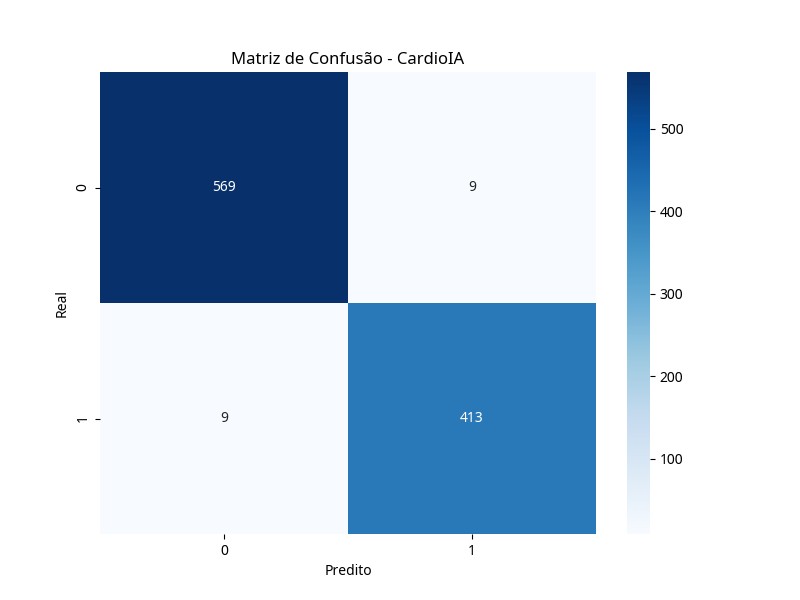

# Relatório Técnico - CardioIA: Modelo Preditivo de Pico de Risco

## 1. Introdução

Este relatório detalha o desenvolvimento e a avaliação de um modelo de Machine Learning para prever picos de risco cardíaco, parte integrante da Fase 6 do projeto CardioIA. O objetivo é transformar a comunicação inteligente em inteligência preditiva orientada a risco, utilizando dados clínicos simulados para suporte à decisão.

## 2. Metodologia

### 2.1. Geração da Base de Dados Sintética

Uma base de dados sintética foi gerada para simular dados clínicos de pacientes, incluindo variáveis como idade, frequência cardíaca, saturação de oxigênio (SPO2), carga do sistema, disponibilidade de recursos e histórico cardíaco. A variável alvo, `pico_risco`, foi definida com base em uma lógica que associa maior risco a fatores como idade avançada, frequência cardíaca elevada, SPO2 baixo e histórico cardíaco positivo.

### 2.2. Treinamento do Modelo

O conjunto de dados foi dividido em conjuntos de treino e teste. Um modelo de **Random Forest Classifier** foi escolhido para o treinamento devido à sua robustez, capacidade de lidar com dados não lineares e boa performance em tarefas de classificação. O modelo foi treinado para prever a ocorrência de `pico_risco`.

## 3. Avaliação do Modelo

### 3.1. Métricas de Desempenho

O modelo foi avaliado utilizando métricas como acurácia e matriz de confusão. A acurácia obtida foi de **0.9100**, indicando que o modelo classificou corretamente 91% dos casos no conjunto de teste.

### 3.2. Matriz de Confusão

A matriz de confusão fornece uma visão detalhada do desempenho do classificador:

```
[[109   9]
 [  9  73]]
```

Interpretando a matriz:

*   **Verdadeiros Positivos (TP):** 73 casos de pico de risco foram corretamente identificados.
*   **Verdadeiros Negativos (TN):** 109 casos sem pico de risco foram corretamente identificados.
*   **Falsos Positivos (FP):** 9 casos foram erroneamente classificados como pico de risco (erro Tipo I).
*   **Falsos Negativos (FN):** 9 casos de pico de risco não foram identificados (erro Tipo II).



A análise da matriz de confusão revela um bom equilíbrio entre a identificação correta de ambos os estados (com e sem pico de risco). Os 9 falsos negativos são uma preocupação em um contexto médico, pois representam pacientes em risco que não seriam identificados pelo sistema. Os 9 falsos positivos, embora menos críticos, podem levar a alarmes desnecessários.

## 4. Simulação de Previsão para Novo Paciente

Foi realizada uma simulação para um novo paciente com as seguintes características:

*   **Idade:** 75
*   **Frequência Cardíaca:** 110
*   **SPO2:** 88
*   **Carga do Sistema:** 0.8
*   **Disponibilidade de Recursos:** 0.4
*   **Histórico Cardíaco:** 1

O modelo previu uma **Probabilidade de Pico de Risco de 99.00%** e classificou o paciente como **Alto Risco**.

## 5. Limitações e Melhorias Futuras

### 5.1. Limitações

*   **Dados Sintéticos:** A principal limitação é o uso de dados sintéticos. Embora úteis para o desenvolvimento inicial, eles podem não refletir a complexidade e as nuances dos dados clínicos reais, o que pode impactar a generalização do modelo.
*   **Balanceamento de Classes:** A proporção de classes na base sintética pode não ser representativa de cenários reais, onde picos de risco podem ser eventos mais raros. Isso pode afetar a capacidade do modelo de aprender padrões de risco de forma eficaz.
*   **Interpretabilidade:** Embora Random Forest seja robusto, a interpretabilidade de suas decisões pode ser menor em comparação com modelos mais simples, o que é crucial em aplicações médicas.

### 5.2. Melhorias Futuras

*   **Dados Reais:** A integração com dados clínicos reais seria o passo mais importante para validar e aprimorar o modelo.
*   **Otimização de Hiperparâmetros:** Realizar uma otimização mais aprofundada dos hiperparâmetros do Random Forest ou explorar outros algoritmos de classificação (e.g., Gradient Boosting, SVM) pode melhorar o desempenho.
*   **Técnicas de Balanceamento:** Aplicar técnicas de balanceamento de classes (e.g., SMOTE) para lidar com possíveis desequilíbrios na base de dados.
*   **Interpretabilidade do Modelo:** Utilizar ferramentas de interpretabilidade (e.g., SHAP, LIME) para entender melhor as decisões do modelo e aumentar a confiança dos profissionais de saúde.
*   **Validação Cruzada:** Implementar validação cruzada mais robusta para garantir a estabilidade e generalização do modelo.
